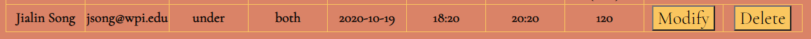

Webware: Assignment 2
---
- Author: Jialin Song
- Webpage: https://a2-jsong2333333.glitch.me/

## Lab time/space slot booking
Due to COVID-19, many labs now requires appointment or sign-in before physically going to the lab. Inspired by that, I made a simple webpage that allows people to make appointment to the space (for experiment, for normal use or both in the lab) and time (date, from/to time) with essential personal information. 

## Requirements
- **Implementation**: All baseline requirements were completed. The form would require user to enter 7 fields, and the table would record 8 fields, with 1 derived field. After submission, the table on the right side of the page would update with your submission. "Modify" amd "Delete" buttons are included for people to change their decisions. Derived field ("Time slot (min)" in the table) was also calculated, which represents the total time he/she scheduled for lab in minute.
- **Demonstration**: Form tag is used to present the submission form on the right side of the webpage, with checkbox, radio, textfield, date and time as input. Table tag is used to show the result within the memory. This page is validated using the link provided. CSS styling is completed with multiple selectors for class, elements and ids. Grid is utilized to split screen left and right. Two Google fonts are used: Cinzel and Cormorant. 

## Technical Achievements
- **Tech Achievement 1**: A single-page app is created. Once the information is submitted on the left side of the webpage, the table on the right side would update with all data stored inside server. The data shown below is intentionally left inside the storage as a reference. 
- **Tech Achievements 2**: The functionality of adding, modifying or deleting data items residing in server's memory is achieved. Adding is completed with the 'submit' button; modifying and deleting can be achieved by the buttons shown beside each table entry.
- **Tech Achievements 3**: Logics are implemented to prevent users booking an illegal date (previous days) or an illegal time ("From" time the same or later than "To" time).

### Design/Evaluation Achievements
- **Design Achievement 1**: Each student was asked to accomplish an appointment with her information. Student Chen and Ying have provided helpful feedback to my webpage.
- Student one feedback:
1. Chen. 
2. She believed that the pop-up for Modify button can be more obvious for users to read. Otherwise, users may not notice about the automatically filled information. Instead, user might thought it's been deleted.
3. Actually, the pop-up was intentionally made to inform user that his/her information will be auto-filled and the data in table will be deleted. However, it is likely that the pop-up is still unclear to some users as they might ignore the words and direcetly hit 'OK'.
4. I would like to change the size and font of the pop-up to be more obvious, maybe change to a window pop-up at the middle of the webpage.
- Student two feedback:
1. Ying.
2. She believed that it would be more convenient if the pre-filled text in "Name" and "Email" field can automatically be deleted when user enter their information.
3. I was surprised that the comments they had were all very detailed points. These points might be neglected by developers, but noticeable for users.
4. I would like to change the pre-filled texts to be auto-deleted once the users attempt to enter their information.
